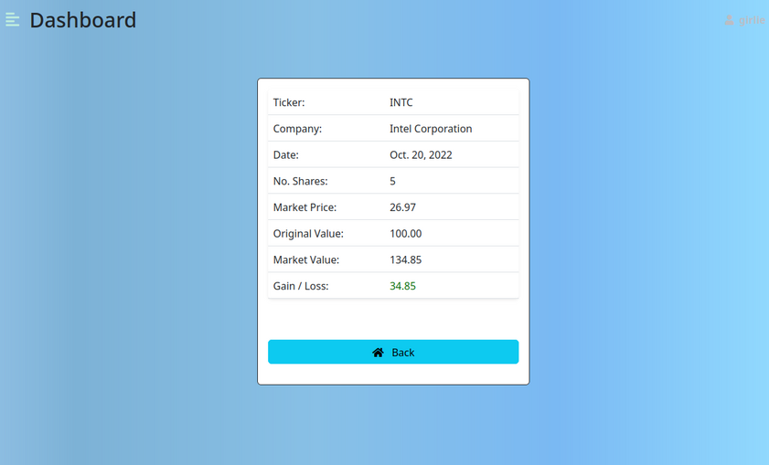

# ShareTracker


ShareTracker is an application written using the Python Django Framework, which maintains a registry stocks and shares you own. It retrieves the market price of these shares, allowing you see their current market value. It shows a gain or loss value for each investment.

[Here is a link to the application](https://tf-sharetracker.herokuapp.com/)

## How to use

You will need to know the stock market ticker or symbol of your investment. Common examples are "IBM" - IBM, "MSFT" - Microsoft, "AAPL" - Apple etc.

Add this ticker using the "Add Trade" screen, specifying the number of shares and price paid per share. Optionally, enter the date on which the shares were purchased.


Once the trade is added the app will query Yahoo Finance and retrieve the latest price for the share. It then multiplies this price by the number of shares you own to produce the **market value**.

The **initial value** is calculated by multiplying the number of shares by the original price paid. 

The net **gain or loss** is the difference between these two numbers.

Once the trade is entered it will be shown on the share listing:


You can then go on to use the Actions Section next to each item on the list. Available actions are to change, delete or show detail on the selected share.
### Share Detail

### Share Delete

## Features

### Existing Features


- Real Time Pricing: The value of the investment is calculated in real time, upon refreshing the shares list. If you are using the app during the opening hours of the various exchanges, you will see the latest pricing available. Conversely, the market price will not update if you are using the app during time when a specific exchange is closed.

- Unlimited Tickers: Add as many symbols as you wish.

- User Security: Password protected to keep others out.

- Clear profit and loss numbers.

- Fully updateable, add, remove, update trades as needed.

- Hideable sidebar.

- Responsive


### Future Features

- Totalling.

- Charting

- Historical Data

- Performance improvements
## User Stories

- [USER STORY: Site Authentication](https://github.com/tomf247/ShareTracker/issues/3)
- [USER STORY: View a list of my shares](https://github.com/tomf247/ShareTracker/issues/4)
- [USER STORY: Add a share record](https://github.com/tomf247/ShareTracker/issues/5)
- [USER STORY: Change a share record](https://github.com/tomf247/ShareTracker/issues/6)
- [USER STORY: Delete a share record](https://github.com/tomf247/ShareTracker/issues/7)
- [USER STORY: Price share to market](https://github.com/tomf247/ShareTracker/issues/8)
- [USER STORY: Responsive Layout](https://github.com/tomf247/ShareTracker/issues/9)
## Data Model 

The application depends on a Data Model internally called Trade.

---
```
    class Trade(models.Model):
    user = models.ForeignKey(User,on_delete=models.CASCADE)
    ticker = models.CharField(max_length=10)
    company_name = models.CharField(max_length=50,null=True)
    share_currency = models.CharField(max_length=3,null=True)
    quantity = models.PositiveIntegerField(null=False)
    purchase_date = models.DateField(("Date"), default=datetime.date.today)
    initial_share_price = models.DecimalField(null=False,max_digits=15,decimal_places=5)
    initial_share_value = models.DecimalField(null=False,max_digits=15,decimal_places=2)
```
The ticker, purchase_date, quantity and initial_share_price fields are captured from the AddTrade form, which is completed by the user. 
The company_name and share_currency are set by a call to the yahoo_fin module, which retrieves them using the ticker as a key from Yahoo.
Initial_share_value is calculated by the app.
There are three properties attached to the model, which calculate latest_share_price, latest_share_value, and latest_gain_loss.
```
    @property
    def latest_share_price(self):
        ''' API call to Yahoo Finance for latest price. '''

        handle = si.get_quote_data(str(self.ticker))
        latest_share_price = handle.get('regularMarketPrice')
        return latest_share_price

    @property
    def latest_share_value(self):
        ''' The market price multiplied by number of shares to show latest value.'''

        latest_share_value = Decimal(self.latest_share_price) * self.quantity
        return self.latest_share_price * self.quantity

    @property
    def latest_gain_loss(self):
        ''' The market value minus the initial value gives us a profit or loss.'''

        return Decimal(self.latest_share_value) - self.initial_share_value
```
---

## Testing

Testing included the following steps:

- A full test suite for forms class validation (test_forms.py). All tests run successfully.
- Verified **User Deletion Cascade** functions correctly.
- Manual tests to verify expected Model/View/Template behaviour.
- Full validation of user input values.
- Tested on multiple browsers and device types both locally and deployed version.

## Bugs

- No known bugs.

## Deployment

This app was deployed to Heroku. There are several key steps to be aware of when deploying Django to Heroku. In deploying this app I came accross some issues.

- Set Debug in settings.py to False
- Add the whitenoise module to get static files to be served
- Make sure Procfile is in the root, not the App or Project folder
- Pay attention to module versioning.
- Set the Heroku flag COLLECT_STATIC_
FILES to False.

### Steps for deployment

- Fork or clone this repository
- Use requirements.txt to install the modules.
- Create a new Heroku app
- Create a PostgreSQL database on Heroku
- Create an env.py in the root folder with the PostgreSQL settings.
- Set the PORT in Heroku settings to 8000

## Credits

I referred to www.stackexchange.com frequently, both for syntax as well as design principles.

The Django documentation as well as MDM was consulted for help with Models and Views.

I am grateful to my mentor Rohit, and also to the online mentors from Code Institute, all of whom offered me welcome support and assistance.
